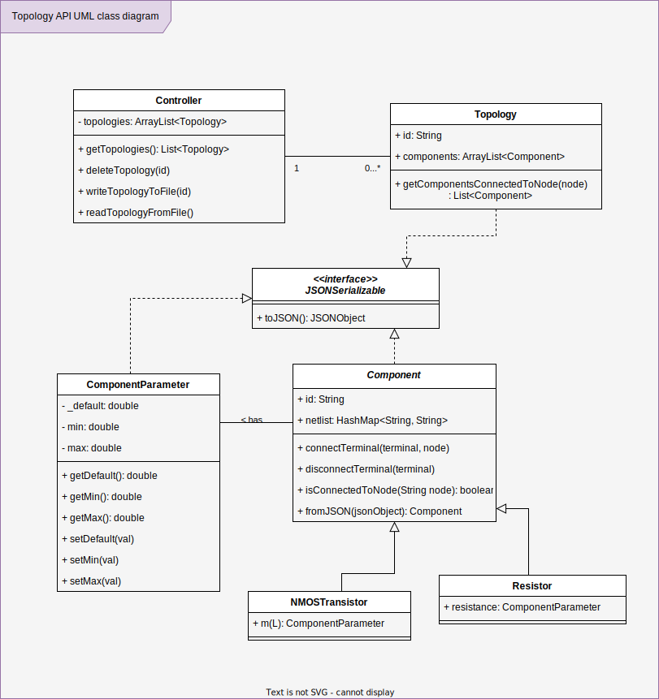

# Topologies API

OOP designed Java library to manage circuits' topologies and provide a functionality to store and read them from the local file system as json file.

## Class UML diagram



## Technologies

I have chosen Java as the programming language to convert the wanted requirements into a reality. But why?

OK, this is a good question. Java is one of the best known languages so it is better to be maintained in the long term by other. And more people can digest the codebase and understand what is going on.

Java was originally developed by Sun Mircosystems (acquired by Oracle now) which is the same developer of many tools that will help us cover all the described requirements.

| Technology | Description                                                                                    |
| ---------- | ---------------------------------------------------------------------------------------------- |
| Java       | Programming language                                                                           |
| Maven      | A build tool to help manage dependencies and easily develop the project independent of the IDE |
| JavaDoc    | A tool provided by Oracle to generate documentations                                           |
| JUnit5     | Testing framework for Java                                                                     |

## Documentation

*Simply open this link:* https://muhammadsawalhy.github.io/TopologyAPI

Or you can generate these docs locally with:

```bash
mvn javadoc:javadoc
# or use make
make docs
```

## How to test

Before testing you need to install all the dependencies with `mvn clean install`. After that you can test with these commands:

```bash
make test
# or with maven directly
mvn test
```

You should be able to see such an delightful test status which indicates that all works fine.

```
[INFO] -------------------------------------------------------
[INFO]  T E S T S
[INFO] -------------------------------------------------------
[INFO] Running mastermicro.topologies.topology.TopologyTests
[INFO] Tests run: 4, Failures: 0, Errors: 0, Skipped: 0, Time elapsed: 0.092 s - in mastermicro.topologies.topology.TopologyTests
[INFO] Running mastermicro.topologies.controller.ControllerTests
[INFO] Tests run: 3, Failures: 0, Errors: 0, Skipped: 0, Time elapsed: 0.021 s - in mastermicro.topologies.controller.ControllerTests
[INFO] Running mastermicro.topologies.components.ComponentParameterTests
[INFO] Tests run: 6, Failures: 0, Errors: 0, Skipped: 0, Time elapsed: 0.017 s - in mastermicro.topologies.components.ComponentParameterTests
[INFO] Running mastermicro.topologies.components.NMOSTransistorTests
[INFO] Tests run: 11, Failures: 0, Errors: 0, Skipped: 0, Time elapsed: 0.034 s - in mastermicro.topologies.components.NMOSTransistorTests
[INFO] Running mastermicro.topologies.components.ResistorTests
[INFO] Tests run: 11, Failures: 0, Errors: 0, Skipped: 0, Time elapsed: 0.024 s - in mastermicro.topologies.components.ResistorTests
[INFO]
[INFO] Results:
[INFO]
[INFO] Tests run: 35, Failures: 0, Errors: 0, Skipped: 0
```

## Test with docker

OK, you can use Docker for more consistency and to make sure all the work is done in a separate environment that won't neither be affected by your machine nor affect it.

```bash
docker --build . --name topologies # build the image
docker run topologies
```

Or to make it easier:

```bash
make docker-test
```

**Note:** when you build the image for the first time it will download the maven image from the DockerHub, so be patient.
